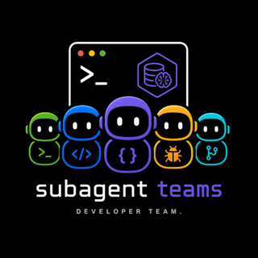
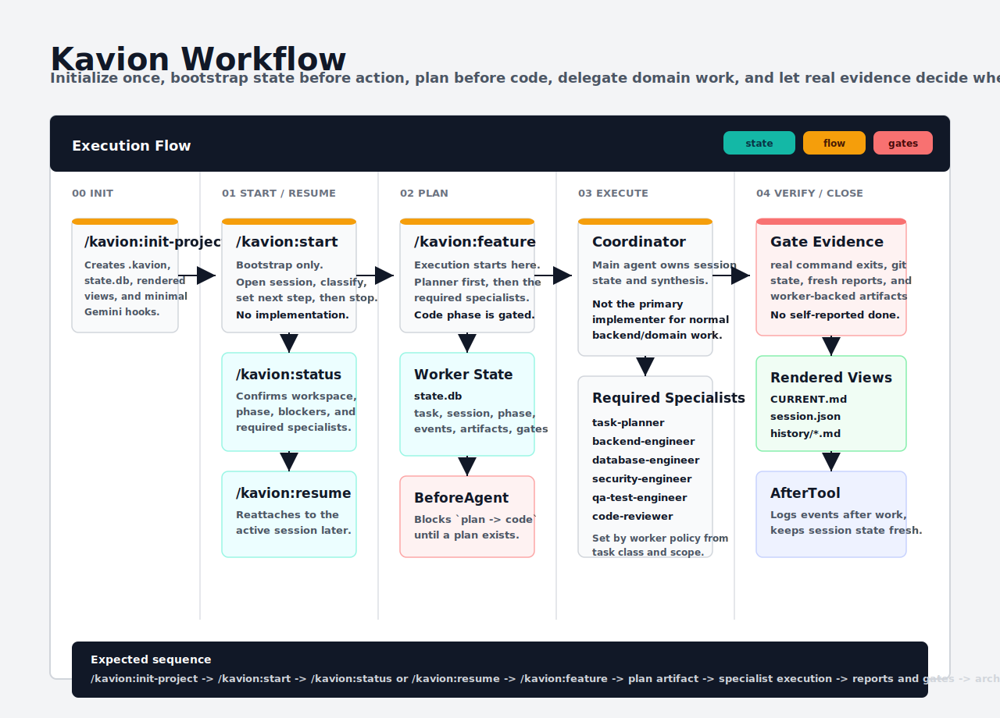

<p align="center">
  
</p>

<p align="center">
  <strong>Structured AI software team workflows with local project memory, real workflow gates, and durable session state.</strong>
</p>

<p align="center">
  <a href="https://github.com/kalpeshchouhan/Kavion"></a>
  <a href="LICENSE"></a>
  
  
  
</p>

# Kavion

Kavion is a local-first workflow system for AI coding CLIs. It keeps project memory small, verification honest, and active work resumable.

Core architecture:

- `.kavion/state.db` is the machine source of truth for task and session state
- `CURRENT.md` and `session.json` are rendered views, not writable state inputs
- `PROJECT.md` and `DECISIONS.md` stay human-authored and git-tracked
- `chunks.jsonl` and `bm25.json` stay rebuildable local search cache
- Gemini hooks observe the workflow and the worker enforces the state machine

<p align="center">
  
</p>

## Quick Start

Current install path:

```bash
gemini extensions link .
```

Restart your CLI after linking or changing extension files.

Inside the CLI:

```text
/extensions list
/kavion:init-project
/kavion:start "Build a settings page"
/kavion:feature "Build a settings page"
/kavion:status
/kavion:gate ship
/kavion:migrate
/kavion:search "auth flow"
```

## Memory Layout

Kavion uses:

```text
.kavion/
  PROJECT.md
  DECISIONS.md
  DECISIONS-archive.md
  CURRENT.md
  session.json
  state.db
  history/
  gates.yaml
  plans/
  reports/
  notes/
  index/
    chunks.jsonl
    bm25.json
    .dirty
```

Design rules:

- SQLite is the machine source of truth.
- `CURRENT.md` and `session.json` are rendered from worker state.
- `PROJECT.md` and `DECISIONS.md` are primary human memory.
- The BM25 index is a rebuildable cache.
- Notes are optional and can expire.

## Gates

Kavion has one gate surface:

```text
/kavion:gate plan
/kavion:gate test
/kavion:gate review
/kavion:gate security
/kavion:gate ship
```

These gates rely on:

- real command exit codes
- report freshness
- git cleanliness
- branch state
- current session state

## Worker + MCP Server

The worker + MCP server now provide:

- workspace initialization
- worker-backed session start and phase transitions
- plan and report artifacts backed by SQLite
- rendered `CURRENT.md` and `session.json`
- BM25 index build and search
- chunk reads
- migration from the file-first memory layout
- note writing with TTL rules
- memory hygiene checks
- real workflow gates

`/kavion:init-project` also installs the minimal Gemini hook set into project `.gemini/settings.json`:

- `SessionStart`
- `BeforeAgent`
- `AfterTool`

The extension now expects dependencies at the extension root. For local development, run `npm install` in the repo root before linking the extension.

The MCP worker binds to the active Gemini workspace through `${workspacePath}`. If `/kavion:status` ever shows the extension install directory instead of your project path, the extension install is stale and needs to be relinked or updated.

## Docs

- [QUICKSTART](docs/QUICKSTART.md)
- [ARCHITECTURE](docs/ARCHITECTURE.md)
- [MEMORY](docs/MEMORY.md)
- [MCP](docs/MCP.md)
- [WORKFLOW-ENFORCEMENT](docs/WORKFLOW-ENFORCEMENT.md)
- [VERSIONING](docs/VERSIONING.md)
- [PUBLISHING](docs/PUBLISHING.md)
- [ADDING-AGENTS](docs/ADDING-AGENTS.md)
- [ADDING-SKILLS](docs/ADDING-SKILLS.md)
- [CONTRIBUTING](CONTRIBUTING.md)
- [SECURITY](SECURITY.md)
