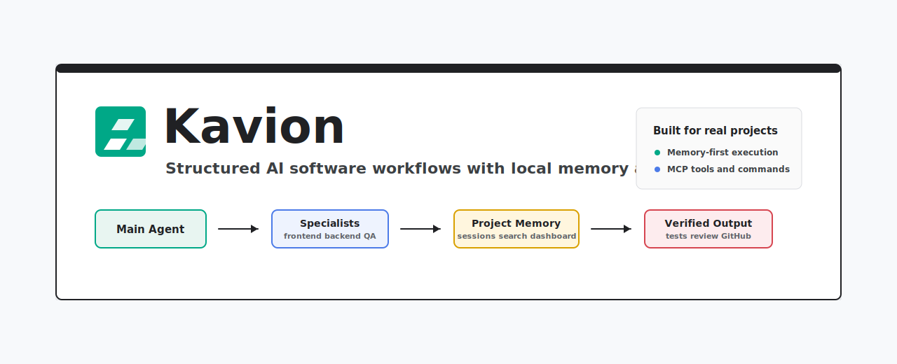

<p align="center">
  
</p>

<p align="center">
  <strong>Structured AI software team workflows with local project memory, real workflow gates, and durable session state.</strong>
</p>

<p align="center">
  <a href="https://github.com/kalpeshchouhan/Kavion"></a>
  <a href="LICENSE"></a>
  
  
  
</p>

# Kavion

Kavion is a local-first workflow system for AI coding CLIs. It keeps project memory small, verification honest, and active work resumable.

Core architecture:

- `PROJECT.md`, `DECISIONS.md`, and `CURRENT.md` replace the old `.gemini/context/` sprawl
- `session.json` and `history.jsonl` replace `sessions/active/` and `sessions/archive/`
- `chunks.jsonl` and `bm25.json` replace the old LanceDB and vector JSONL memory cache
- gates use real command output and filesystem state instead of trusting self-written reports

<p align="center">
  
</p>

## Quick Start

Current install path:

```bash
gemini extensions link .
```

Restart your CLI after linking or changing extension files.

Inside the CLI:

```text
/extensions list
/kavion:init-project
/kavion:feature "Build a settings page"
/kavion:init-project
/kavion:status
/kavion:gate ship
/kavion:migrate
/kavion:search "auth flow"
```

## Memory Layout

Kavion uses:

```text
.gemini/kavion/
  PROJECT.md
  DECISIONS.md
  DECISIONS-archive.md
  CURRENT.md
  session.json
  history.jsonl
  gates.yaml
  plans/
  reports/
  notes/
  index/
    chunks.jsonl
    bm25.json
    .dirty
```

Design rules:

- Markdown and JSON files are the source of truth.
- The BM25 index is a rebuildable cache.
- `CURRENT.md` and `session.json` are the hot memory.
- `PROJECT.md` and `DECISIONS.md` are read on demand, not every turn.
- Notes are optional and can expire.

## Gates

Kavion has one gate surface:

```text
/kavion:gate plan
/kavion:gate test
/kavion:gate review
/kavion:gate security
/kavion:gate ship
```

These gates rely on:

- real command exit codes
- report freshness
- git cleanliness
- branch state
- current session state

## MCP Server

The MCP server now provides:

- workspace initialization
- session update/archive
- BM25 index build and search
- chunk reads
- migration from the old memory layout
- note writing with TTL rules
- memory hygiene checks
- real workflow gates

Enable it after running `npm install` in `mcp-server/`.

## Docs

- [QUICKSTART](docs/QUICKSTART.md)
- [ARCHITECTURE](docs/ARCHITECTURE.md)
- [MEMORY](docs/MEMORY.md)
- [MCP](docs/MCP.md)
- [WORKFLOW-ENFORCEMENT](docs/WORKFLOW-ENFORCEMENT.md)
- [VERSIONING](docs/VERSIONING.md)
- [PUBLISHING](docs/PUBLISHING.md)
- [ADDING-AGENTS](docs/ADDING-AGENTS.md)
- [ADDING-SKILLS](docs/ADDING-SKILLS.md)
- [CONTRIBUTING](CONTRIBUTING.md)
- [SECURITY](SECURITY.md)
