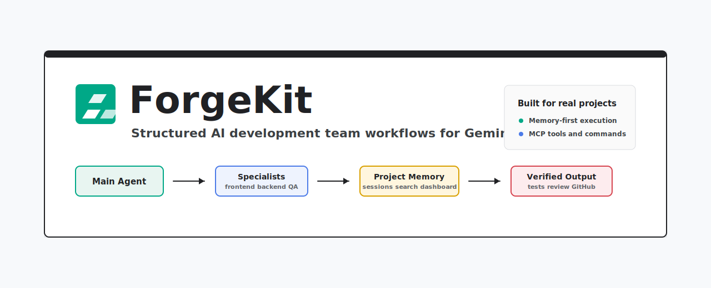
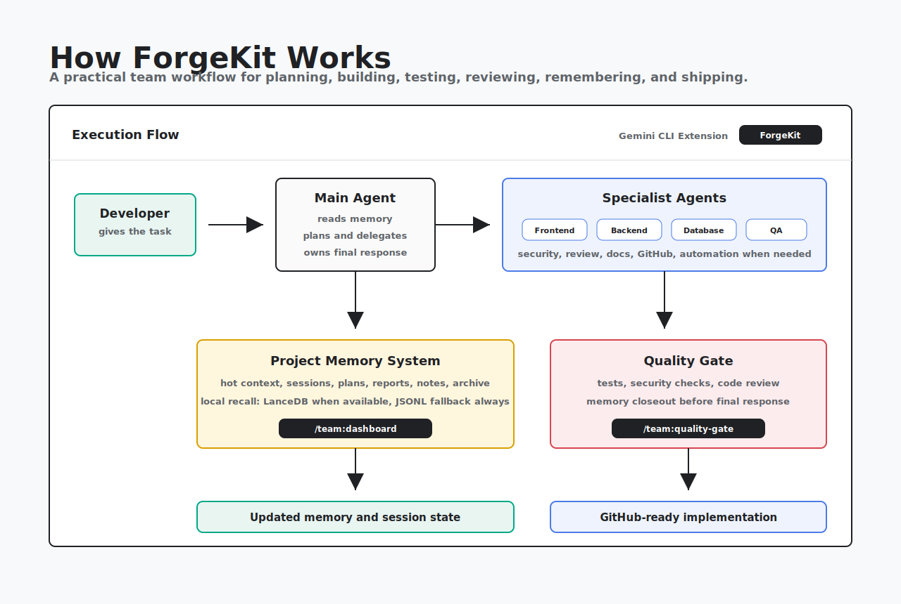

<p align="center">
  
</p>

<p align="center">
  <strong>Turn Gemini CLI into a structured AI software team with project memory, specialist agents, MCP tools, QA, review, and GitHub workflow.</strong>
</p>

<p align="center">
  <a href="https://github.com/kalpeshchouhan/forgekit"></a>
  <a href="LICENSE"></a>
  
  
  
</p>

# ForgeKit

ForgeKit is a Gemini CLI extension that turns a single Gemini session into a
structured software team workflow.

It provides:

- specialist agents for frontend, backend, database, review, security, QA, and
  docs/memory work
- team commands for orchestration, bug fixing, review, session state, and
  quality gates
- project-memory and session-state conventions under `.gemini/`
- local memory index/search commands with token-safe recall limits
- optional LanceDB-backed local vector search with JSONL fallback
- workflow enforcement for checkpoints, handoff, and release readiness
- optional policy and MCP tooling for stricter workflow control

<p align="center">
  
</p>

This repository follows the official Gemini CLI extension shape:

- `gemini-extension.json` defines the extension.
- `GEMINI.md` provides extension context.
- `commands/` contains custom slash commands.
- `agents/` contains custom subagents.
- `policies/` contains workflow guardrails.
- `skills/` contains workflow playbooks.
- `templates/` contains project memory templates.
- `mcp-server/` contains the optional workflow-state MCP server.

## Status

ForgeKit is usable now as a strong beta:

- extension loading works
- core memory/session workflow exists
- orchestration, bug-fix, and quality-gate flows work
- memory indexing can refresh automatically through the MCP server
- dashboard, audit, search, and pruning commands are available
- workflow checkpointing helps prevent false "done" states

The main remaining risk is Gemini CLI runtime compliance: if the main model
ignores a workflow instruction, ForgeKit can detect and report the missing
memory/index update, but it cannot force Gemini CLI to execute every command.

## Quick Start

From this directory:

```bash
gemini extensions link .
```

Restart Gemini CLI after linking or changing extension-level files.

Inside Gemini CLI:

```text
/extensions list
```

Then test:

```text
/team:init-project
/team:orchestrate "Build a settings page"
/team:fix-issue "Memory workflow is incomplete"
/team:session-update
/team:quality-gate
/team:dashboard
```

Validation commands:

```bash
gemini extensions validate .
python3 -c "import tomllib; tomllib.load(open('commands/team/fix-issue.toml','rb'))"
node --check mcp-server/index.js
```

## Commands

- `/team:init-project`
- `/team:orchestrate`
- `/team:fix-issue`
- `/team:feature`
- `/team:debug`
- `/team:review`
- `/team:pr`
- `/team:status`
- `/team:session-update`
- `/team:resume`
- `/team:archive`
- `/team:quality-gate`
- `/team:checkpoint`
- `/team:workflow-audit`
- `/team:handoff`
- `/team:release-readiness`
- `/team:security-audit`
- `/team:perf-check`
- `/team:a11y-audit`
- `/team:compliance-check`
- `/team:memory-update`
- `/team:memory-index`
- `/team:memory-search`
- `/team:memory-audit`
- `/team:memory-compact`
- `/team:dashboard`

## Docs

- [QUICKSTART](docs/QUICKSTART.md)
- [ARCHITECTURE](docs/ARCHITECTURE.md)
- [MEMORY](docs/MEMORY.md)
- [MCP](docs/MCP.md)
- [WORKFLOW-ENFORCEMENT](docs/WORKFLOW-ENFORCEMENT.md)
- [VERSIONING](docs/VERSIONING.md)
- [PUBLISHING](docs/PUBLISHING.md)
- [ADDING-AGENTS](docs/ADDING-AGENTS.md)
- [ADDING-SKILLS](docs/ADDING-SKILLS.md)
- [CONTRIBUTING](CONTRIBUTING.md)
- [SECURITY](SECURITY.md)

## Community Files

- [LICENSE](LICENSE)
- [CODE_OF_CONDUCT](CODE_OF_CONDUCT.md)
- [CHANGELOG](CHANGELOG.md)

## Optional Policies

ForgeKit ships policy templates in `policies/`. Gemini CLI loads policies from
`~/.gemini/policies/*.toml` or configured `policyPaths`. To activate:

```bash
mkdir -p ~/.gemini/policies
ln -sf "$(pwd)/policies/team-guardrails.toml" ~/.gemini/policies/forgekit-team-guardrails.toml
```

## Optional MCP Workflow Server

The optional MCP server powers stronger automation:

- session status tools
- memory index/search/audit tools
- memory compaction helpers
- workflow checkpoint and release-readiness tools
- project dashboard
- optional local LanceDB vector backend

Enable it after running `npm install` in `mcp-server/`. See
[MCP](docs/MCP.md).

## Contributing

Before opening this to other developers, read:

- [CONTRIBUTING](CONTRIBUTING.md)
- [ARCHITECTURE](docs/ARCHITECTURE.md)
- [MEMORY](docs/MEMORY.md)
