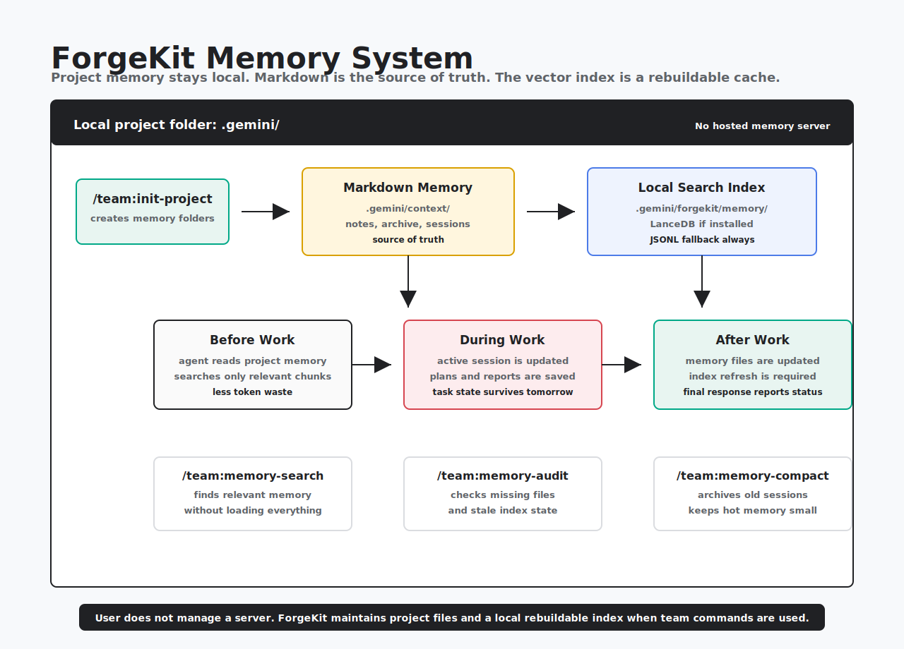

# Memory Model

ForgeKit uses two related but different memory layers.

<p align="center">
  
</p>

## Hot Project Memory

Hot memory lives in `.gemini/context/`:

- `project-brief.md`
- `architecture.md`
- `commands.md`
- `testing.md`
- `current-work.md`
- `decisions.md`
- `github.md`

This is the small stable context that the project-level `GEMINI.md` loads first.

## Warm Notes

Warm notes live in `.gemini/notes/`.

Use them for:

- temporary research
- logs
- exploratory notes
- details that should not pollute hot context

## Cold Archive

Cold archive lives in `.gemini/archive/`.

Move stale or large material there when it no longer belongs in hot memory.

## Session State

Task-local changing execution state lives in `.gemini/forgekit/`:

- `sessions/active/`
- `sessions/archive/`
- `plans/`
- `reports/`

Use session state for:

- current phase
- files touched
- verification logs
- blockers
- next step

Do not keep fast-changing execution detail in hot memory.

## Local Memory Index

ForgeKit can maintain a local searchable memory index under:

```text
.gemini/forgekit/memory/
  manifest.json
  memory.jsonl
  vectors.jsonl
  lancedb/
```

Markdown remains the source of truth. The index is only a cache for recall.

The default backend mode is `auto`:

- use local LanceDB when `@lancedb/lancedb` is installed
- fall back to JSONL metadata and local hash-vector recall when LanceDB is not available
- always store source paths for every result

This is local-first. It does not send memory to a hosted vector database.

Set `FORGEKIT_VECTOR_BACKEND` for explicit control:

```bash
FORGEKIT_VECTOR_BACKEND=auto
FORGEKIT_VECTOR_BACKEND=lancedb
FORGEKIT_VECTOR_BACKEND=jsonl
```

The LanceDB backend is optional because it uses a native package. ForgeKit keeps
the JSONL/hash-vector backend as a safe fallback so memory search still works
when native dependencies are unavailable.

## Automatic Refresh

ForgeKit workflows require memory index refresh after meaningful memory or
session-state writes:

- feature work
- bug fixes
- session updates
- memory updates
- initialization
- compaction

When MCP is enabled, workflows should call `forgekit_index_memory`. When MCP is
not enabled, workflows should apply `/team:memory-index` logic manually or
report the index refresh as deferred.

## Pruning

Use `/team:memory-compact` to keep hot memory small.

Safe compaction rules:

- archive completed sessions instead of deleting them
- move detailed history from `.gemini/context/current-work.md` to notes or archive
- keep hot memory under the configured byte budget
- rebuild the index after compaction
- never store secrets

## Token Safety

Do not load the full index into a prompt.

Recommended limits:

- top results: 5
- max chunk size: 1200 characters
- max total recall: 5000 characters
- always read the source file before relying on a recalled chunk

## Commands

- `/team:init-project`: create starter memory structure
- `/team:memory-update`: sync stable progress into hot memory
- `/team:session-update`: update task-local session state
- `/team:memory-index`: build or refresh the local memory index
- `/team:memory-search`: search local memory with bounded recall
- `/team:memory-audit`: check memory health and missing files
- `/team:memory-compact`: move stale detail out of hot memory
- `/team:dashboard`: show memory, session, plan, report, and index status
- `/team:archive`: move finished sessions out of active state

## Rule Of Thumb

- stable and reusable: hot memory
- changing task detail: session state
- temporary detail: notes
- old or bulky: archive
- search and recall: local memory index
