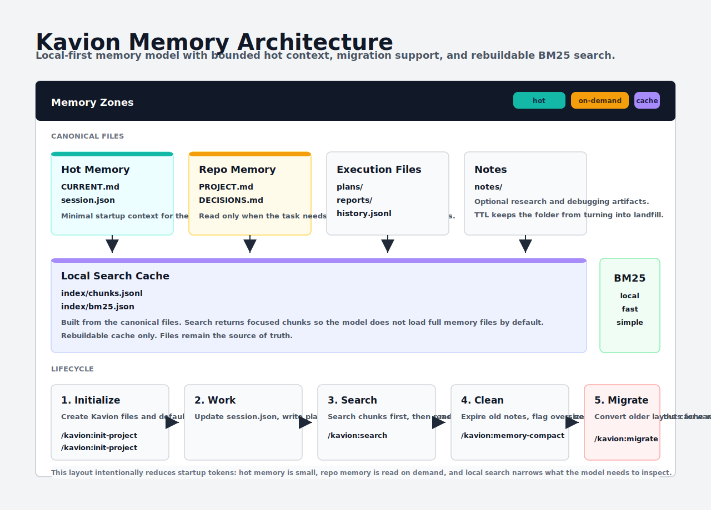

# Kavion Memory

Kavion uses a smaller, stricter memory model.



## Layout

```text
.kavion/
  PROJECT.md
  DECISIONS.md
  DECISIONS-archive.md
  CURRENT.md
  session.json
  state.db
  history/
  gates.yaml
  plans/
  reports/
  notes/
  index/
    chunks.jsonl
    bm25.json
    .dirty
```

## What Each File Does

- `CURRENT.md`
  - rendered hot memory
  - active task, class, phase, blockers, next step

- `session.json`
  - rendered structured session view
  - sourced from `state.db`

- `state.db`
  - machine source of truth
  - tasks, sessions, events, artifacts, gate runs

- `PROJECT.md`
  - repo-level truths
  - architecture and conventions

- `DECISIONS.md`
  - durable technical decisions

- `history/`
  - rendered session history views

- `plans/`
  - multi-step work plans

- `reports/`
  - canonical QA, review, and security evidence only
  - not for execution-step logs or generic progress notes

- `notes/`
  - optional research/debug notes
  - subject to TTL unless marked persistent
  - should exist only when findings are reusable

- `index/`
  - local BM25 search cache
  - rebuildable

## Rules

- SQLite is the machine source of truth
- rendered views are not hand-edited
- the index is only a cache
- read `CURRENT.md` first
- read `PROJECT.md` and `DECISIONS.md` only when needed
- keep `PROJECT.md` under 300 lines
- keep `CURRENT.md` under 50 lines
- use notes only for reusable research/debug material
- do not duplicate the same fact across many files

## Search

Kavion indexes memory into:

```text
.kavion/index/chunks.jsonl
.kavion/index/bm25.json
```

Use:

```text
/kavion:search "query"
```

Advanced/manual fallbacks still exist:

```text
/kavion:memory-index
/kavion:memory-search "query"
```

## Migration

Older Kavion projects may still have:

```text
.gemini/context/
.gemini/archive/
.kavion/session.json as direct state
.kavion/history.jsonl
```

Kavion can migrate those into the new structure with:

```text
/kavion:migrate
```
